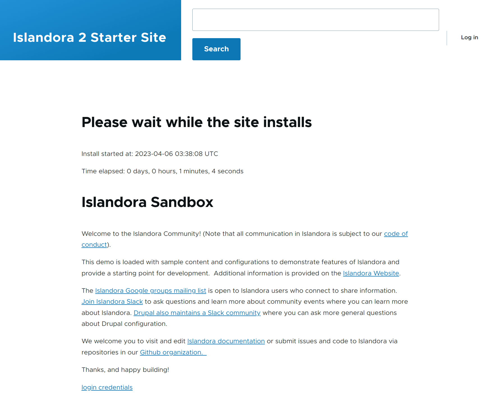

# Islandora Sandbox <!-- omit in toc -->

[](./LICENSE)
[](https://github.com/Islandora-Devops/sandbox/actions/workflows/push.yml)

## Table of Contents <!-- omit in toc -->
- [Introduction](#introduction)
- [Requirements](#requirements)
- [Running Locally](#running-locally)
- [Updating](#updating)
- [Releases](#releases)
- [GitHub Actions](#github-actions)
  - [Deployment Environments](#deployment-environments)
  - [Environment Variables](#environment-variables)
  - [Domains](#domains)
  - [Volumes](#volumes)

## Introduction

This repository is responsible for packaging, uploading, and deploying releases
of the [Islandora Sandbox] on [Digital Ocean]. It is **not** intended as a
starting point for new users or those unfamiliar with Docker and basic server
administration.

If you are looking to use Islandora, please read the [official documentation]
and use either [isle-dc] or [isle-site-template] to deploy via Docker, or the
[islandora-playbook] to deploy via Ansible.

## Requirements

- [Docker 20.10+](https://docs.docker.com/get-docker/)

## Running Locally

To build the sandbox locally, use the following command:

```bash
docker compose build
```

Then you can bring up the sandbox with the following command:

```bash
docker compose up -d
```
> Note: It may take **a few minutes** to start, as the site installation and
> data import processes need to be completed.

This will bring up the environment based on [islandora-starter-site]. After
about a minute or two you can monitor the progress by visiting the site at
<http://islandora.io>:



By default the credentials for everything will be:

| Field    | Value    |
| :------- | :------- |
| Username | admin    |
| Password | password |

Additionally all other services and be found at their respective sub-domains.

| Service    | URL                                     |
| :--------- | :-------------------------------------- |
| Drupal     | http://islandora.io                     |
| ActiveMQ   | http://activemq.islandora.io            |
| Blazegraph | http://blazegraph.islandora.io/bigdata/ |
| Fedora     | http://fcrepo.islandora.io/fcrepo/rest/ |
| Matomo     | http://islandora.io/matomo/index.php    |
| Cantaloupe | http://islandora.io/cantaloupe          |
| Solr       | http://solr.islandora.io                |
| Traefik    | http://traefik.islandora.io             |

This will use the **current** [buildx] builder instance. See [isle-builder] for
how to setup and use a builder for multi-platform builds.

## Updating

This repository makes use of the Docker images produced by [isle-buildkit].
Since the data in this repository is meant to be ephemeral you can safely update
the images without requiring migrations of existing data.

You can change the commit used for external dependencies:

- [islandora_workbench]
- [islandora_demo_objects]
- [islandora-starter-site]

By modifying the appropriate `XXX_COMMIT` build argument in the
[Dockerfile](./drupal/Dockerfile). You can then update the `XXX_SHA256` with the
following commands (replacing `var` with the appropriate prefix for the
dependency you are updating):

```bash
var=STARTER_SITE
commit=$(grep -E "^ARG ${var}_COMMIT" drupal/Dockerfile | awk -F= '{print $2}' | tr -d '\n')
file=$(grep -E "^ARG ${var}_FILE" drupal/Dockerfile | awk -F= '{print $2}' | tr -d '\n' | sed "s/\${${var}_COMMIT}/$commit/")
url=$(grep -E "^ARG ${var}_URL" drupal/Dockerfile | awk -F= '{print $2}' | tr -d '\n' | sed "s/\${${var}_FILE}/$file/")
sha256=$(curl -sL $url | shasum -a 256 | awk '{print $1}')
sed -e "s/ARG ${var}_SHA256=.*/ARG ${var}_SHA256=${sha256}/" -i '' drupal/Dockerfile
```

## Releases

Creating a new release will trigger two [actions](#github-actions):

1. Push a new deployment to [Digital Ocean] performed by [deploy.yml].
2. Package a zip file for local use and attach it to the release, performed by [package.yml].

To create a new release, follow these steps in the GitHub repository:

1. Go to [releases].
2. Select `Draft new release`.
3. Enter a new tag by incrementing the number from the previous release.
4. Select `Create a new tag: x.x.x on publish`, targeting the `main` branch.
5. Select `Generate release notes`.
6. Add any additional notes you think are relevant.
7. Make sure `Set as the latest release` is selected.
8. Click `Publish release`.

These steps will trigger the aforementioned actions.

The release will first deploy to: https://test.sandbox.islandora.ca

You can then visit and review the deployment. If necessary, you can cancel the
workflow [here](https://github.com/Islandora-Devops/sandbox/actions/workflows/deploy.yml).

Alternatively, you can approve the deployment, which will then deploy to:
<https://sandbox.islandora.ca>. Afterward, the deployment at
<https://test.sandbox.islandora.ca> will be destroyed.

## GitHub Actions

This repository utilizes [GitHub Actions] for various tasks.

| Workflow       | Trigger                  | Description                                                                                                                                                                                                         |
| :------------- | :----------------------- | :------------------------------------------------------------------------------------------------------------------------------------------------------------------------------------------------------------------ |
| [deploy.yml]   | On new tag               | Builds and pushes `islandora/sandbox:${TAG}` image and deploys it to [Digital Ocean].                                                                                                                               |
| [package.yml]  | On new release           | Creates a zip file containing a Docker Compose configuration file for an Islandora Sandbox, and attaches it to a GitHub release.                                                                                    |
| [push.yml]     | On push to `main` branch | Builds and pushes `islandora/sandbox:main` image.                                                                                                                                                                   |
| [snapshot.yml] | Manually                 | Creates a snapshot of a Fedora CoreOS image on DigitalOcean. Used as the base image for deployments to [Digital Ocean]. Note that this **does not wait** for completion and may take a long time (1h+ to complete). |

The above workflows make use of the following [reusable workflows]:

| Workflow     | Description                                                                                                                               |
| :----------- | :---------------------------------------------------------------------------------------------------------------------------------------- |
| [bake.yml]   | Builds and pushes a Docker image to a Docker registry.                                                                                    |
| [create.yml] | Creates a DigitalOcean Droplet and assigns it a reserved IP address. Destroys any preexisting droplet with the same name before creation. |

### Deployment Environments

We use two [deployment environments] for [GitHub Actions], defined in the
[environment settings] of the GitHub repository.

- test
- sandbox

### Environment Variables

Each deployment environment has specific variables used to distinguish them from one another.

| Deployment Environment | DOMAIN                    | RESERVED_IP_ADDRESS | VOLUME_NAME          |
| :--------------------- | :------------------------ | :------------------ | :------------------- |
| test                   | test.sandbox.islandora.ca | 174.138.112.33      | test-certificates    |
| sandbox                | sandbox.islandora.ca      | 159.203.49.92       | sandbox-certificates |

Additionally, several variables are shared between both environments.

| Variable      | Example Value                                                | Description                                                                          |
| :------------ | :----------------------------------------------------------- | :----------------------------------------------------------------------------------- |
| REGION        | `tor1`                                                       | The region for deploying [Digital Ocean] droplets.                                   |
| SIZE          | `s-4vcpu-8gb-intel`                                          | The size of the droplet to create when deploying.                                    |
| SNAPSHOT_NAME | `fedora-coreos-37.20230205.3.0-digitalocean.x86_64.qcow2.gz` | The snapshot image used for deployment, created by the [snapshot.yml] GitHub Action. |
| SSH_KEY_NAME  | `default`                                                    | The SSH key deployed to the droplet on creation.                                     |

### Domains

Domains are registered via [hover] but we use [Digital Ocean] nameservers
instead of those provided by [hover], as we needed support for DNS challenges to
automatically generate wildcard certificates. LetsEncrypt does not support
[hover].

The `DOMAIN` and `RESERVED_IP_ADDRESS` mentioned in the
[previous section](#environment-variables) must match the `A Records` in the
nameservers set up in [Digital Ocean].

### Volumes

Each volume referenced by the `VOLUME_NAME` environment variable refers to a
manually configured volume storing the certificates generated by LetsEncrypt.
This avoids hitting rate limit problems when performing multiple deployments in
a week, as the number of requests allowed by LetsEncrypt is very low.

[bake.yml]: .github/workflows/bake.yml
[buildx]: https://docs.docker.com/engine/reference/commandline/buildx
[create.yml]: .github/workflows/create.yml
[deploy.yml]: .github/workflows/deploy.yml
[deployment environments]: https://docs.github.com/en/actions/deployment/targeting-different-environments/using-environments-for-deployment
[Digital Ocean]: https://www.digitalocean.com/
[environment settings]: https://github.com/Islandora-Devops/sandbox/settings/environments
[Github Actions]: https://docs.github.com/en/actions/quickstart
[hover]: https://www.hover.com/
[Islandora Sandbox]: https://sandbox.islandora.ca/
[islandora_demo_objects]: https://github.com/Islandora-Devops/islandora_demo_objects
[islandora_workbench]: https://github.com/mjordan/islandora_workbench
[islandora-playbook]: https://github.com/Islandora-Devops/islandora-playbook
[islandora-starter-site]: https://github.com/Islandora/islandora-starter-site
[islandora-starter-site]: https://github.com/Islandora/islandora-starter-site
[isle-builder]: https://github.com/Islandora-Devops/isle-builder
[isle-buildkit]: https://github.com/Islandora-Devops/isle-buildkit
[isle-dc]: https://github.com/Islandora-Devops/isle-dc
[isle-site-template]: https://github.com/Islandora-Devops/isle-site-template
[official documentation]: https://islandora.github.io/documentation/
[package.yml]: .github/workflows/package.yml
[push.yml]: .github/workflows/push.yml
[releases]: https://github.com/Islandora-Devops/sandbox/releases
[reusable workflows]: https://docs.github.com/en/actions/using-workflows/reusing-workflows
[snapshot.yml]: .github/workflows/snapshot.yml
